# playwright
Repo to learn Playwright

## Build Status
[](https://github.com/CDTester/playwright/actions/workflows/playwright.yml)
[](https://github.com/CDTester/playwright/actions/workflows/pages/pages-build-deployment)

## Latest CI/CD Build Report
https://cdtester.github.io/playwright/playwright-report/  <br/>
https://cdtester.github.io/playwright/allure-report/


## Playwright

### Browser 
A browser has the following set-up:
- context - provides a way to operate independent browser sessions. 
- pages - A context can contain multiple pages. This will share resources of the context. e.g. cookies. Page provides methods to interact with a single tab in a browser

### Base Page
The Base page can provide common functions to be used for each test script. They can contain tear up and tear down features.

### Page Obejct Model
Page Object Models provides locators and methods to interact with a specific web page. These pages acn be imported into any test script or fixture to speed up writing and maintaining tests. Any changes to a page only need to be updated in one place. 

The Page Object Model extends the Base Page.

### Fixtures
Fixture files are used to group together Page Object Models, these files can also contain tear up and tear down procedures for those specific group of POMs. The test scripts import the fixture which should contain everything that test needs to run.

### Annotations
Playwright supports tags and annotations that are displayed in the test report.
- test.skip() marks the test as irrelevant and is not executed by Playwright.
- test.fail() marks the test as failing and is executed by Playwright. If the test does not fail, Playwright will complain.
- test.fixme() marks the test as failing and is not executed by Playwright. Use fixme when running the test is slow or crashes.
- test.slow() marks the test as slow and triples the test timeout.
- test.describe() groups together tests to give then the same logical name/feature.
- test('scenario', { tag: [@smoke, @feature] }) tags are a great way to run certain tests in your library by running `npx playwright test --grep @smoke` or ignoring specific tags by running `npx playwright test --grep-invert @smoke`
- test.beforeEach() will run tear up procedures before each test in the group.
- test.afterEach() will run tear down procedures after each test in the group.

### Executing Playwright Tests
Playwright scripts can be executed using the command
```
npx playwright test
```

In this repo, environment specific values are stored in a config file. This contains values like urls, usernames, passwords etc. The module that gets these values requires the env name to be stored in the `process.env` variables. The way I do this is by using package script, e.g.

```json
  "scripts": {
    "test": "playwright test",
    "testChrome": "playwright test --project=chromium",
    "testWebkit": "playwright test --project=webkit"
  },
```

Then running the scripts using:
```bash
npm run test --testenv=dev1
```

### Playwright Reporter
Playwright comes with a built in reporters:
- list. 
```shell
Running 3 tests using 2 workers
  ✓  1 …sts\Todo\add.spec.ts:45:7 › Add Todo › Item should be cleared from the input field when an item is added @Todo @Add @regression (2.8s)  
  ✓  2 [chromium] › tests\Todo\add.spec.ts:24:7 › Add Todo › Allow an item to be added to ToDo @Todo @Add @smoke (7.1s)
  ✓  3 [chromium] › tests\Todo\add.spec.ts:64:7 › Add Todo › Item should be appended to the bottom of the list @Todo @Add @regression (2.1s)
```
- line.
```shell
Running 3 tests using 2 workers
  3 passed (8.8s)
```
- dot.
```shell
Running 3 tests using 2 workers
···
  3 passed (7.7s)
```
- html. These are opened automatically if the test fails.
```shell
Running 3 tests using 2 workers
  3 passed (10.0s)

To open last HTML report run:
  npx playwright show-report
```
**Summary**
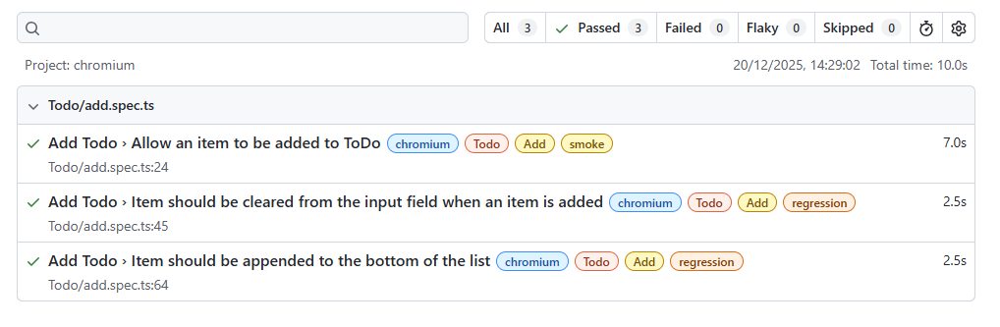

**Steps**

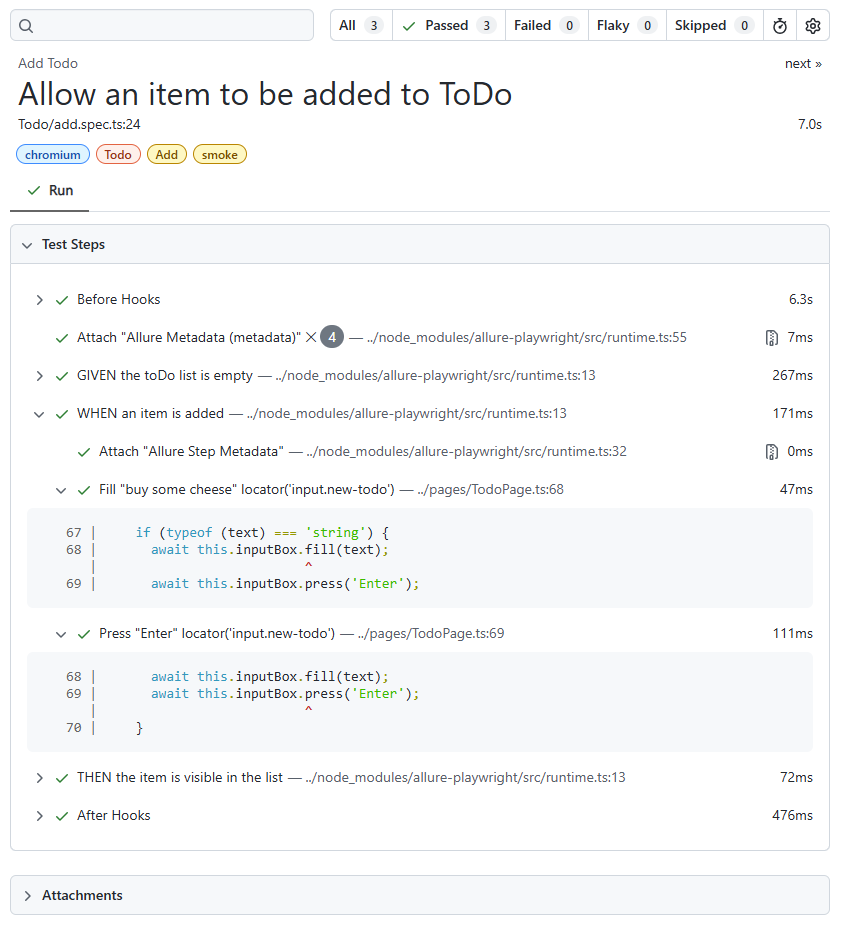


These can be viewed either by:
- `npx playwright test --reporter=line` This runs the test then launches the reporter
- In the `playwright.config.ts` file.  
```Typescript 
export default defineConfig({
  reporter: [    ['html'] ]
})
```

### Allure Reporter
The Allure reporter offers a richer report with historic run trends and displaying test run by:
 - Suites (when using allure parentSuite, suite and subSuite)
 - Behaviours (when using allure epic, feature and story)
 - Packages
 - Errors (Categories)
 - historical trend graphs
 - test run timeline

Some setup is required in the `playwright.config.ts` file. See [config](#config) section

In the scripts, the following functions can be added from `import * as allure from "allure-js-commons";` :
- allure.owner('Chris');
- allure.tms('PLAY-012');
- allure.issue('BUG-012');
- allure.severity(allure.Severity.CRITICAL);
- allure.parentSuite('ParentSuite: Playwright');
- allure.suite('Suite: Menu Tests');
- allure.subSuite('SubSuite: Menu - Large Screen');
- allure.epic('Epic: TodoMVC');
- allure.feature('Feature: Add ToDo Item');
- allure.story('Story: Add ToDo Item to the list');
- allure.step(`GIVEN ${homePage.url} has loaded`, async ( step ) => { await homePage.goto(); });
- step.parameter('Page Title', await homePage.page.title());
- allure.attachmentPath(filename, path, {contentType: allure.ContentType.PNG, fileExtension: 'png'});

**Allure report: Overview**
This screen of the report provides an overview of:
- how many tests were run and their status. 
- Environment information that is set up in the playwright config file.
- Test failure category summary. Test failures are assigned categories that indicate whether tests failed due to product issues or test issues.
- Trends from previous runs, how the current test run compares to previous runs.

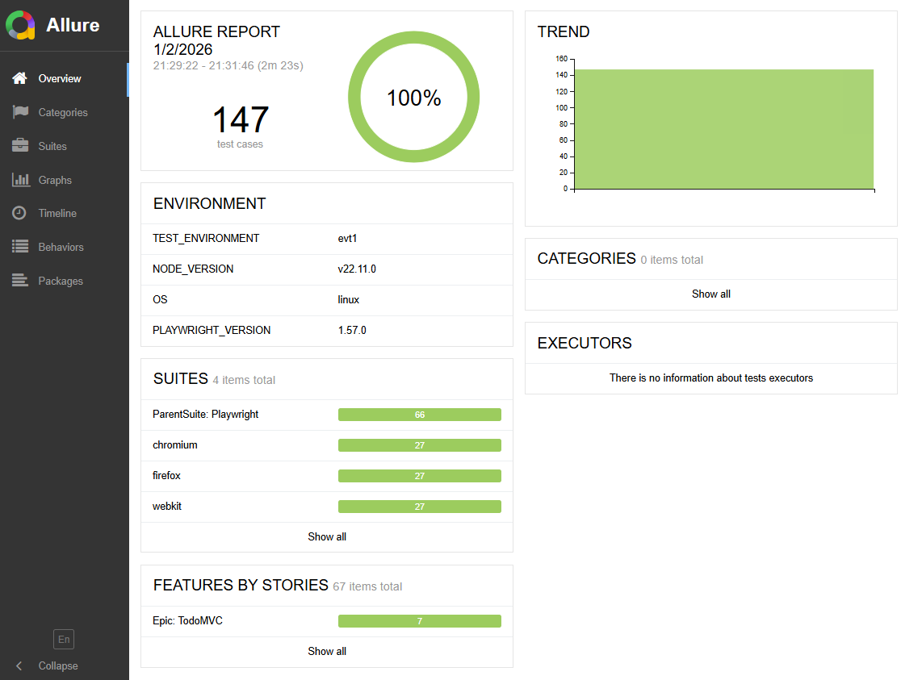

**Allure report: Suites**
If you design your tests using parentSuite/suite/subSuite, then this page orders your tests using that suite structure. 

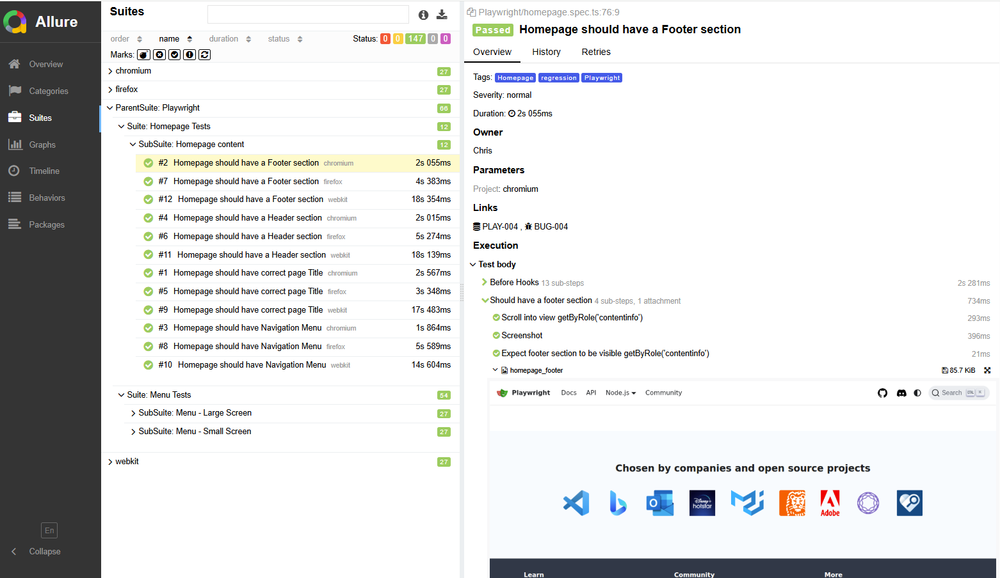

> [!NOTE]<br/>
> this image shows suites for chromium, firefox and webkit. These come from tests that are designed using behaviour (epic/feature/story).


**Allure report: Behaviors**
If you design your tests using epic/feature/story, then this page orders your tests using that behaviour structure. 

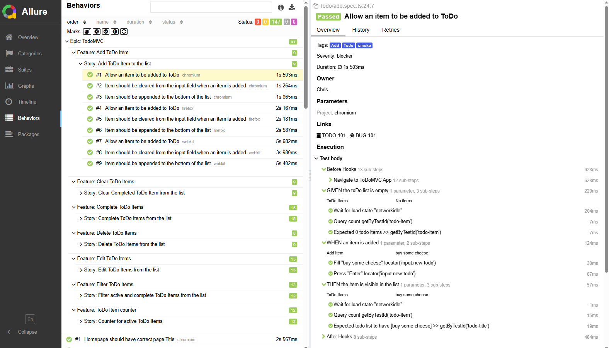

> [!NOTE]<br/>
> this image shows tests that are not designed using behaviour features. These tests are show in an unstructured manor..


**Allure report: Packages**
The Packages pages shows the test run reports based by package name. Ignoring any suite/behaviour structure.

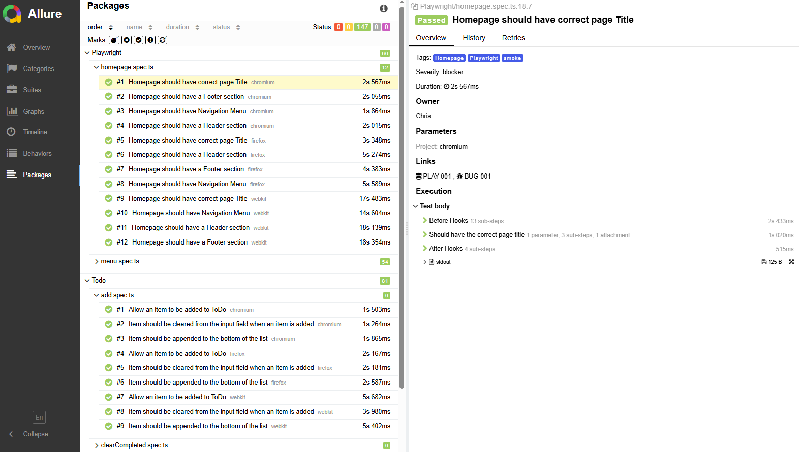


**Allure report: Graphs**
This screen of the report provides historic trends.... tbc

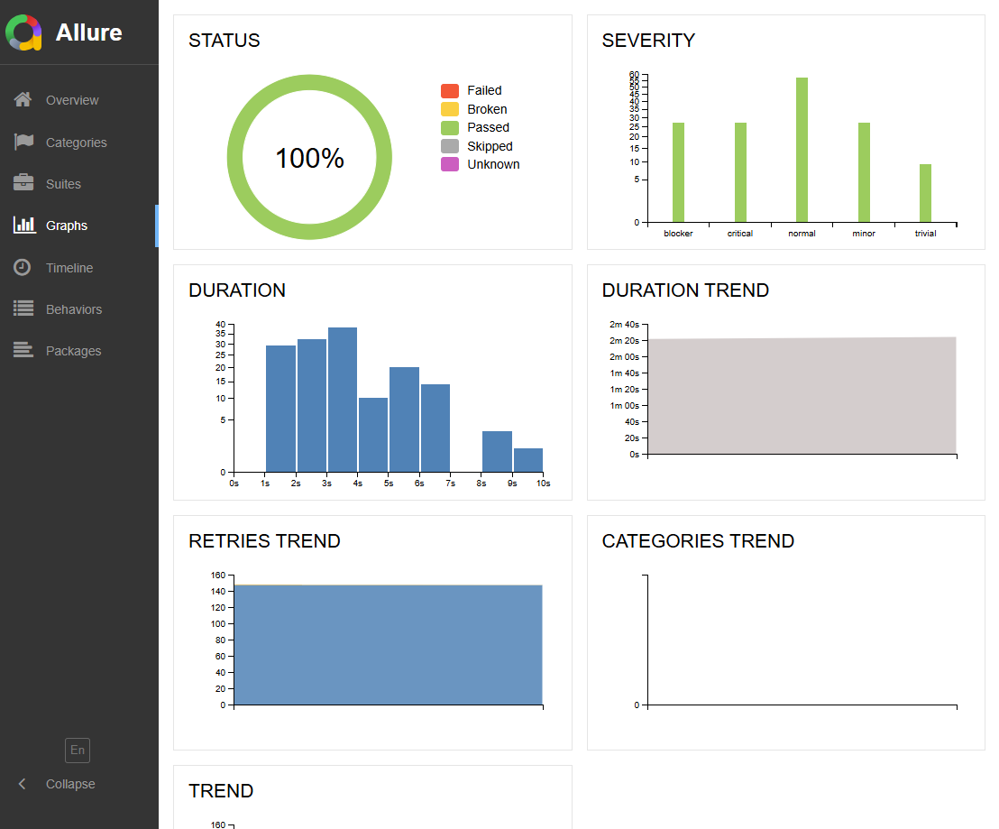

### Config
The `playwright.config.ts` file configures how your test run.
- `testDir: './tests'` Location of tests. When running `npx playwright test` this is the location of the tests to be run
- `fullyParallel: true`  Allows tests to be run in parallel mode. 
- `workers: process.env.CI ? 4 : undefined` This tells the CI process to use 4 workers in parallel mode or use default number for local runs.
- This defines what reporters to be used including the config for each reporter.
```typescript
reporter: [
  ['html'], 
  ['allure-playwright',{
    detail: true,
    outputFolder: 'allure-results',
    suiteTitle: false,
    categories: [
      { name: 'Critical failures', messageRegex: '.*critical.*' },
      { name: 'test script failures', messageRegex: '.*Error: locator.*' }
    ],
    environmentInfo: { 
      TEST_ENVIRONMENT: process.env.npm_config_testenv,
      NODE_VERSION: process.version, 
      OS: process.platform, 
      PLAYWRIGHT_VERSION: require('playwright/package.json').version, 
    },
    links: {
      issue: {
        urlTemplate: 'https://jira.example.com/browse/%s',
        nameTemplate: '%s'
      },
      tms: {
        urlTemplate: 'https://tms.example.com/testcase/%s',
        nameTemplate: '%s'
      }
    },
    openAlluredir: 'playwright-report/allure-results',
  }]
  ]
  ```

- The following rules determine the characteristics of the browser
```typescript
use: {}` Options:
    `headless: true`. Sets whether tests are to be run headless or not.
    `screenshot: 'only-on-failure'`. Other option are on, off, retain-on-failure
    `video: 'retain-on-failure'`. Other options are on, off, on-first-retry
    `viewport: { width: 1200, height: 700 }`. Sets screen size. 
    `geolocation: { latitude: 29.97918, longitude: 31.13420 }
```

- Configures projects for test to be run on different browsers or individual test projects setup, test data and teardown process
```typescript
projects: []`. 
    `{name: 'chromium', use: { ...devices['Desktop Chrome'] } }`
    `{name: 'firefox', use: { ...devices['Desktop Firefox'] } }`
    `{name: 'webkit', use: { ...devices['Desktop Safari'] } }`
    `{name: 'Mobile Safari', use: { ...devices['iPhone 12'], isMobile: true } }
```

### Locators
Use playwright getBy...() locators when possible as they have auto-waiting and retry-ability features. 
- .getByRole() to locate by explicit and implicit accessibility attributes.
- .getByText() to locate by text content.
- .getByLabel() to locate a form control by associated label's text.
- .getByPlaceholder() to locate an input by placeholder.
- .getByAltText() to locate an element, usually image, by its text alternative.
- .getByTitle() to locate an element by its title attribute.
- .getByTestId() to locate an element based on its data-testid attribute (other attributes can be configured).

> [!Important]<br/>
> See more details about those here [Locators](./docs/locators.txt).

Other locators:
  - text: text='text to find' (add single quotes for exact match)
  - id: id='id value' (add single quotes for exact match)
  - xpath: //selector[@attribute='value']
  - css: 
    - by class:     selector.classname | .classname
    - by id:        selector#idname | #idname
    - by atribute:  selector[attribute=value] | [attribute=value]


### Session Storage
Playwright allows you to save the browsers context storage state (cookies and localStorage) and load it later, bypassing the login flow.

> [!Caution]<br/>
> As the session storage allows access to your logged in state, care must be taken if your usernames and passwords are sensitive information. This goes for your login data files as well. 

> [!TIP]<br/>
> Therefore you should never commit these fies to your version control. Add it to `.gitignore` file and handle it securely.

> [!WARNING]<br/>
> These tokens have expiry dates in the format of Unix time in seconds, so if you version control is private then it would be a good idea to change the exiry date to a date much further into the future. Or you can add logic in your CI or test setup to refresh the session state.


#### Setup to use storage session

**Test Data and creation of auth state**<br/>
In /test-data/pages/LoginData there are 2 files:
- [HerokuappData.ts](./test-data/pages/LoginData/HerokuappData.ts) is a test data file containing various user details. As the username and password are detailed on the herokuapp webpage, there is no need to place this file in a secrets manager.
- [HerokuappAuth.ts](./test-data/pages/LoginData/HerokuappAuth.ts) is a class containing a setup method to log in to the herokuapp site using the the test data from the above file and stores the storageSession to a temporary file.

**Fixture for Herokuapp**<br/>
This [fixture file](./fixtures/loginHerokuappFixture.ts) contains: 
* fixtures for both POMs of the herokuapp site
* test data from HerokuappData.ts
* a fixture a logged in state which calls the HerokuappAuth.ts

**Tests**<br/>
The [Login test](./tests/Login/herokuappLogin.spec.ts) contains tests:
* uses the POMS along with the test data from the fixtuer to test the login process
* uses the logged in POM file to test that the logged in page can be access via the storage session


### API
Playwright can be used to get access to the REST API of your application.

Sometimes you may want to send requests to the server directly from Node.js without loading a page and running js code in it. A few examples where it may come in handy:
* Test your server API.
* Prepare server side state before visiting the web application in a test.
* Validate server side post-conditions after running some actions in the browser.

#### API calls to the same browser context
Each Playwright browser context has associated with it APIRequestContext instance which shares cookie storage with the browser context and can be accessed via browserContext.request or page.request. 

#### API calls to other base URLs
It is also possible to create a new APIRequestContext instance manually by calling apiRequest.newContext().

Looking at [tests/Api](./tests/Api/) there are tests for:
- GET requests
- POST requests
- PUT requests
- PATCH requests
- DELETE requests
- API authorization tests
- API schema validation tests

The structure for API tests is similar to the POM structure of the page tests:
```shell
├─ pages
│  └─ Api/
│     ├─ BaseApi.ts
│     ├─ ApiBaseUrlExample1
│     │   ├─ EndpointA.ts
│     │   └─ EndpointB.ts
├─ tests/
│  └─ Api/
│     ├─ BaseUrl
│     │   ├─ EndpointA.spec.ts
│     │   └─ EndpointB.spec.ts
├─ test-data/
│  |─ Api/
│  │  └─ userData.ts
│  |─ Schemas/
│     └─ EndpointA.ts
```

**Page/Api/BaseApi.ts**
Contains methods for GET, POST, PUT, PATCH, DELETE and schema validator. Thes methods contain Allure reporting of the request and reponse of the API calls.

**Page/BaseUrl/EndpointA.ts**
Extends BaseApi.ts. Contains methods for that endpoints and imports the relevant schema for that endpoint.

**test-data/Schema/BaseUrl/EndpointA.ts**
Contains the schemas for the responses of that endpoint.

**test-data/Api/BaseUrl/data.ts**
Contains the test data test scenarios.

**test.spec.ts**
Imports endpoints classes and test data. 


#### Cookie management
APIRequestContext returned by browserContext.request and page.request shares cookie storage with the corresponding BrowserContext. Each API request will have Cookie header populated with the values from the browser context. If the API response contains Set-Cookie header it will automatically update BrowserContext cookies and requests made from the page will pick them up. This means that if you log in using this API, your e2e test will be logged in and vice versa.

If you want API requests to not interfere with the browser cookies you should create a new APIRequestContext by calling apiRequest.newContext(). Such APIRequestContext object will have its own isolated cookie storage.


### API Mocking
Some web pages have dynamic data that you may want to be static so that the tests do not fail. With Playwright you can inercept the response and change the dynamic data with a value that can be repeateably tested. 
```typescript
await page.route('*/**/**urlEnding', async (route) =>  {
  const resp = await route.fetch();
  const json = await resp.json();
  json.keyName = 'static value';  // keyName will be replaced buy the actual key whose value you want to change

  await route.fulfill({res, json});
});
```


### Agents
Run init-agents to initialise AI agents

Currently you can use vscode or claude as the AI agent (loop)

```bash
 npx playwright init-agents --loop=vscode

 🎭 Using project "chromium" as a primary project
 📝 specs\README.md - directory for test plans
 🌱 tests\seed.spec.ts - default environment seed file
 🤖 .github\agents\playwright-test-generator.agent.md - agent definition
 🤖 .github\agents\playwright-test-healer.agent.md - agent definition
 🤖 .github\agents\playwright-test-planner.agent.md - agent definition
 🔧 .vscode\mcp.json - mcp configuration
 🔧 .github\workflows\copilot-setup-steps.yml - GitHub Copilot setup steps


 🔧 TODO: GitHub > Settings > Copilot > Coding agent > MCP configuration
------------------------------------------------------------------
{
  "mcpServers": {
    "playwright-test": {
      "type": "stdio",
      "command": "npx",
      "args": [
        "playwright",
        "run-test-mcp-server"
      ],
      "tools": [
        "*"
      ]
    }
  }
}
------------------------------------------------------------------
 ✅ Done.
```

This creates an agent folder in .github folder with the following files:
- playwright-test-generator.agent.md
- playwright-test-healer.agent.md
- playwright-test-planner.agent.md

#### MCP
A Model Context Protocol (MCP) server that provides browser automation capabilities using Playwright. This server enables LLMs to interact with web pages through structured accessibility snapshots, bypassing the need for screenshots or visually-tuned models.


#### Agent- Planner
Planner agent explores your app and produces a test plan for one or many scenarios and user flows. It does not take requirements to produce scenarios, therefore is not as effective when planning before development has started. 

In the newly created `tests\seed.spec.ts` file, add any fixtures you may want to use. In this example I am using the ToDo fixture as I want to create a test plan of the todo app.

```typescript
import { test, expect } from '@playwright/test';
import * as allure from "allure-js-commons";

test.describe('Test group', () => {
  test('seed', async ({ page }) => {
    // generate code here.
  });
});
```

**Input:**
Now open a chat window:
- attach seed.spec.ts file
- select agent `playwright-test-planner`
- choose AI e.g. Claude
- prompt: `generate a test plan for usong the ToDo app and save as Todo_Plan in the specs folder`

> [!TIP]<br/>
> improved Prompt:<br/>
> `generate a test plan for using the ToDo app https://demo.playwright.dev/todomvc/#/ and save as Todo_Plan in the specs folder. Write the test scenarios in BDD format. Each Scenario should test only one feature.`

> [!NOTE]<br/>
> The scenarios were not given in BDD (Gherkin) format even though I asked for this. A further request was needed to convert them_

**Results:**
The following is produced:

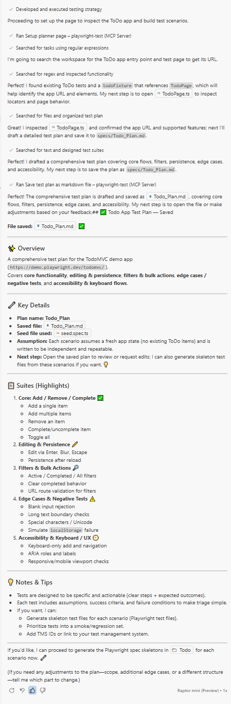

Here is a comparison of test scenarios generated by Playwright from the first prompt compared to test scenarios generated by an actual person.

| AI Scenario | Non AI Scenario | Analysis |
|-------------|-----------------|----------|
| | `File: Todo/add.spec.ts` | | 
| 1.1. Add a single ToDo item | Item can be added to ToDo list  | AI test scenario tests multiple features in one scenario, (adds item to list, clears input field and tests counter). Scenarios should only verify one feature |
| | The input field should be cleared when the item is added | |
| 1.2. Add multiple ToDo items | Item should be appended to the bottom of the list | The non AI scenario is a multiple item scenario it checks each item is added to the bottom of the list. The AI scenario again checks the counter, the counter is a seperate feature |
|4.1. Blank input should not add an item | | The AI came up with some edge cases that I overlooked. | 
|4.2. Long text item (boundary) | | The AI came up with some edge cases that I overlooked. | 
|4.3. Special characters, whitespace and Unicode | | The AI came up with some edge cases that I overlooked. | 
| | `File: Todo/delete.spec.ts` | | 
| | The delete button should be visible when hovering over an item | The AI scenario includes this in one scenario | 
|1.3. Remove a ToDo item | An item can be removed from using the delete button | The AI scenario also includes the counter feature, this should be a seperate test | 
| | An item can be removed when an empty text string is entered during edit | This scenario was not picked up by the AI |
| | `File: Todo/complete.spec.ts` | | 
| | All items checkbox should be initially unchecked | This verification is not provided in the AI scenarios |
|1.4. Complete and uncomplete an item |Items can be marked as complete | The AI scenario also tests the counter feature, and uncompletes the item. Should be seperate scenarios |
| |Completed item can be marked as active again | |
|1.5. Toggle all (Mark all as complete/uncomplete) |All items can be marked as completed in one click | AI scenario also tests the mark all uncomplete and counter  |
| | All completed items can be marked as incomplete in one click | |
| | `File: Todo/edit.spec.ts` | | 
| | Complete Checkbox should be hidden when editing | This scenario was not picked up by the AI|
|2.2. Edit ToDo and save via blur | Edits are saved when the edit field is unfocused| |
|2.1 Edit ToDo and save via Enter | Edits are saved when Enter is pressed| |
| | Whitespace before and after text is removed when saving| This scenario is almost covered by AI in the 4.3 scenario, but the AI scenario is on the add item feature  |
|2.3. Edit ToDo and cancel via Escape | Cancel edit by using escape| |
| | `File: Todo/filter.spec.ts` | | 
| | There should be 3 filters available when there are items on the list| |
|3.1. Filter views (All, Active, Completed) | The 'All' filter should show active and completed items| The AI scenario tests 3 sceanrios in on scenario. This is bad practice because if only the completed filter fails, then the test fails even if other filters work as expected |
| | The 'Active' filter should show only active items| |
| | The 'Completed' filter should only show completed items| |
| | `File: Todo/clearCompleted.spec.ts` | | 
| | The 'Clear Completed' button is hidden when there are no completed items| |
| | The 'Clear Completed' button is visible when there are completed items| |
|3.2. Clear completed removes only completed items | The 'Clear Completed' button should remove completed items| |
| | `File: Todo/counter.spec.ts` | | 
|1.1. Add a single ToDo item | The counter should increase when an item is added| |
|1.3. Remove a ToDo item | The counter should decrease WHEN an item is completed| |
|1.5. Toggle all (Mark all as complete/uncomplete) | The counter should display 0 items left WHEN all items are complete| |
| `File: Todo/edge-localstorage.spec.ts` | | |
|4.4. Simulate localStorage failure (negative) | | This scenario was missed by myself | 
| `File: Todo/persistence.spec.ts` | | |
|2.4. Persistence after page reload | | This scenario was missed by myself | 
| `File: Todo/accessibility-add.spec.ts` | | |
|5.1. Add item using keyboard only (tab + enter) | | This scenario was missed by myself | 
| `File: Todo/accessibility-roles.spec.ts` | | |
|5.2. Checkboxes and roles present for screen readers | | This scenario was missed by myself | 
| `File: Todo/responsive.spec.ts` | | |
|5.3. Responsive layout (mobile viewport) | | This scenario was missed by myself | 


> [!NOTE]<br/>
> My second attempt with the improved prompt, provided the scenerios below. Although there are separate counter scenarios, the add/delete/complete scenarios still include counter verifications. Also some scenarios that were missed with the first prompt are now created on the second prompt. The promt chat did include my README.md which had analysis of the first prompt (above), so it is not clear if the missed scenarios have been determined from that file.
> 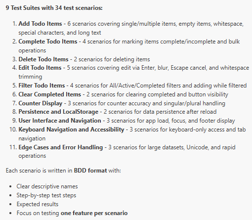


The plan is saved [here](./specs/Todo_Plan.md)


<br/>**Analysis:**<br/>
On the whole the AI agent picks up most scenarios and more edge case/usability tests that were missed by myself. The only 3 cons to using this tool from what I can see are:
- it can only be used when the application has been develeoped. It does not create scenarios during the planning stage.
- it assumes that the application is currently bug free, tests are based on what it can currently do, not what it was intended to do.
- Some scenarios contain multiple feature tests which need to be seperated out.


#### Agent - Generator
Generator agent uses the Markdown plan to produce executable Playwright Tests. It verifies selectors and assertions live as it performs the scenarios. Playwright supports generation hints and provides a catalog of assertions for efficient structural and behavioral validation.

<br> **Input** <br>
Now open a chat window:
* attach plan.md file
* select agent `playwright-test-generator`
* choose AI e.g. Claude
* prompt: `generate a test file for each suite in the Todo_Plan. Write tests to the folder 'tests/Todo/AI'. Use best practices like POM and fixtures. Add Allure reporting along with allure steps to the scenarios. Add tags to the sceanrios. Add allure severity to the scenarios. Add error handling messages to the assertions. `

<br> **Comparison of scripts:** <br>
The AI agent generates a file per scenario, whereas I asked on the prompt to create a file per suite.<br>
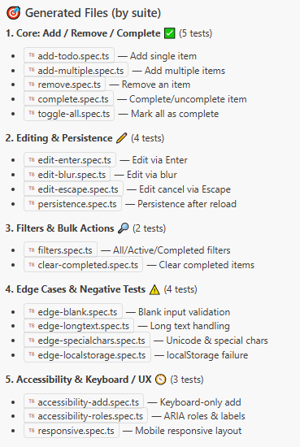

> [!CAUTION]<br/>
> There also some other errors in the scripts. e.g. [add-long-text.spec.ts](./tests/Todo/AI/add-long-text.spec.ts) has a step.parameter with a value as an integer that needs converting to a string.

<br>**The allure reporting:**<br>
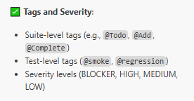

> [!CAUTION]<br/>
>The allure severity levels assigned are not actual level.<br>
>The levels should be:
> * BLOCKER
> * CRITICAL
> * NORMAL
> * MINOR
> * TRIVIAL

<br/>

> [!NOTE]<br/>
>The epics, features and story are based on test structure. These should be based on actual epic/feature/story titles used for developing the feature. As this information has not been provided to the AI, we cannot expect it to know what those titles are. Therefore there would be a need to update those titles in the scripts, as well as adding `allure.tms()` and `allure.issue()`.

<br>**Error handling:**<br>
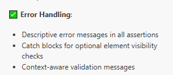

The Error handling has some issues, especially when not the right assertions are performed. e.g on the [add-special-chars.spec.ts](./tests/Todo/AI/add-special-chars.spec.ts). The step is meant to check that the characters are the same as how they were entered, however the script is just checking the element is visible. The web element was defined by the text, but if this was not preserved the web element would not be found and the error would be reported there.

```Typescript
  await allure.step('THEN the item appears with special characters preserved', async (step) => {
    const itemElement = page.getByText('Buy milk @$#%!');
    await expect(itemElement, 'Item should contain special characters exactly as entered').toBeVisible();
  });
```

I do not think this is the best approach, I would make sure the list is empty before, then add the text, then get the first item in the list and do an assertion on the text.

Allure report from AI:<br>
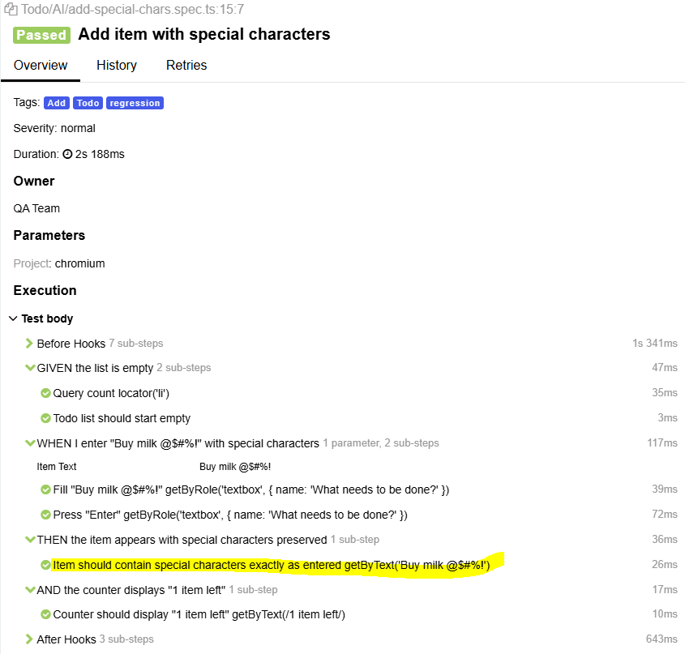


Allure report from me:<br>
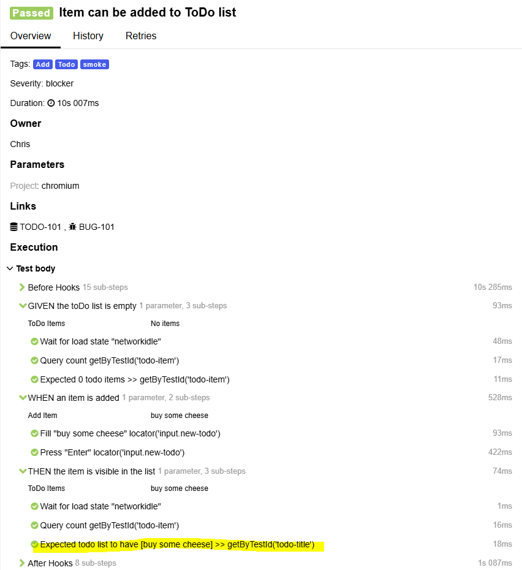


<br>**Readable Test Structure:**<br>
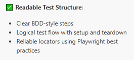

There is one script that does not use the Gherkin language correctly, but this was created by the planner, not the generator:
File: `tests/Todo/checkbox-accessibility.spec.ts`
Steps:
  1. Given the ToDo app has loaded with item 'Buy milk'
  2. Then the checkbox has accessible label 'Toggle Todo'
  3. When I use keyboard to navigate to the checkbox
  4. And I press Space or Enter to toggle it
  5. Then the checkbox state changes
  6. And the state is properly announced

This should be:
 1. Given...
 2. And...
 3. When...
 4. And..
 5. Then...
 6. And...

<br/>Also on:
File: `tests/Todo/edge-unicode.spec.ts`
Steps:
  1. Given the ToDo app has loaded
  2. When I add item '🛒 Buy milk'
  3. Then the emoji displays correctly
  4. When I add item with Chinese characters '買牛奶'
  5. Then all Unicode characters are displayed correctly

<br/>This should be 
 1. Given...
 2. When...
 4. And...
 3. Then...
 5. And...


<br>Maintainable Code:<br>
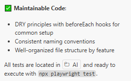

> [!CAUTION] <br>
> Best Practices like a POM has not been implemented. 

When Running these tests, 23 passed and 15 failed. Use the Healer agaent to fix these.

#### Agent - Healer
When the test fails, the healer agent:
* Replays the failing steps
* Inspects the current UI to locate equivalent elements or flows
* Suggests a patch (e.g., locator update, wait adjustment, data fix)
* Re-runs the test until it passes or until guardrails stop the loop

<br> **Input** <br>
Now open a chat window:
- attach test files
- select agent `playwright-test-healer`
- choose AI e.g. Claude
- prompt: `run and fix the tests`


<br>**Results**<br>
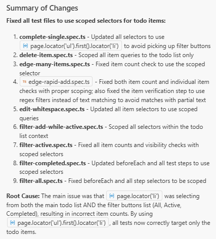

The user is presented with options to keep or undo changes.

The healer is not fixing the Typescript issues where it has used invalid enum values for the allure.Severity().


#### using AI chat to create POM
https://www.youtube.com/watch?v=emUaq9FPIcc

> [!IMPORTANT] <br/>
> Use playwright MCP to run the test scenario defined in `test location`. Refactor existing tests to use proper page object models located in `pages location`.Do not change the existing functionality and do not create new tests.

This creates poms with assertions in the POM. The POM should not perform assertions as the methods in POMS should return values to the test so that the test verifies the value. For example a POM method could take in a value and perform an action with that data. The data could provide various results, therefore you want the test to have the assertions and the POM to do all the actions.

> [!IMPORTANT] <br/>
> Check the page object models in the POM directory and tell me if they are using best practices.


